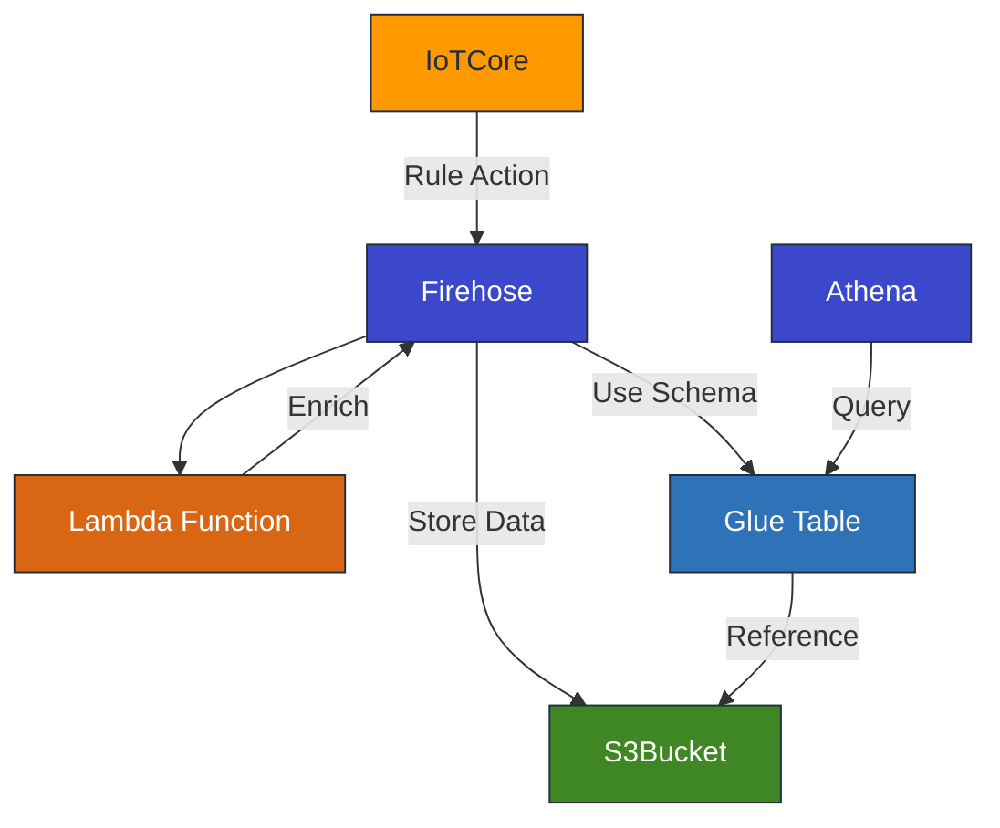

# firehoseを使ってs3にparquet形式でデータを保存する

firehoseを使ってs3にparquet形式でデータを保存してみました。
IoT Core * firehose * S3 はよく使うのですが、parquet形式はやったことなかったので勉強になりました。

## 今回やること

- IoT Core -> Firehose -> S3の構成でデータをS3に保存する
  - データはparquet形式で保存する
  - データはSNAPPYで圧縮する
- データはathenaからクエリできるようにする
  - パーティションを用いてコストとパフォーマンスを最適化する
  - パーティションのキーは日付（JST）を用いる
- CDKで構築する
  - cdkデプロイするだけでテストデータの投入も行われる

## 構成図



## CDK

```ts
// 全文
```

## まとめ

Glue TableはAthenaのためにスキーマ定義を書くときに使っていて「なぜAthenaの機能じゃないんだ？」と思っていました。
今回parquet変換のためにスキーマが使われるのを見て「Athenaのサブ機能ではなかったのか。。。」ということを理解できました。

コードは以下のリポジトリにおいてあります。

https://github.com/yamatatsu/play-firehose-s3-glue-athena